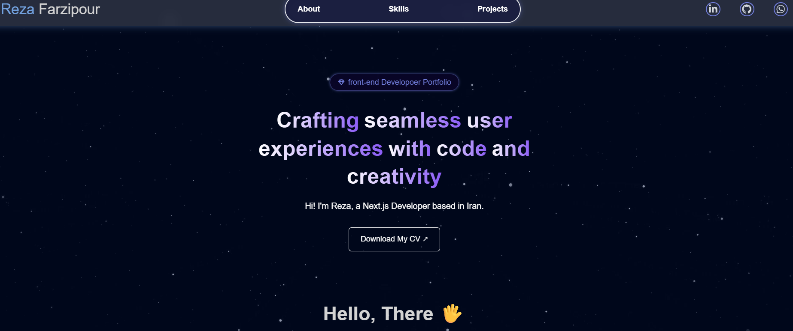
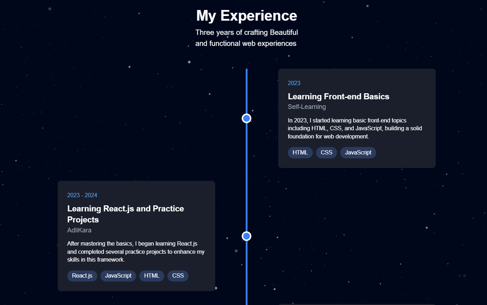
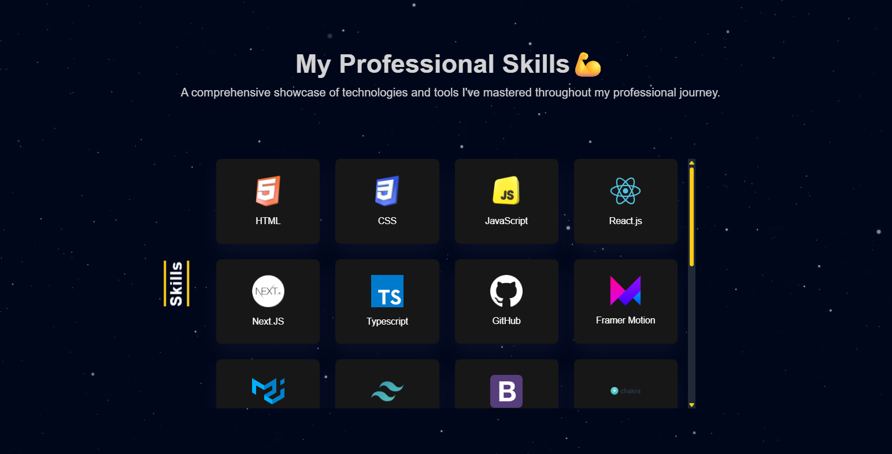
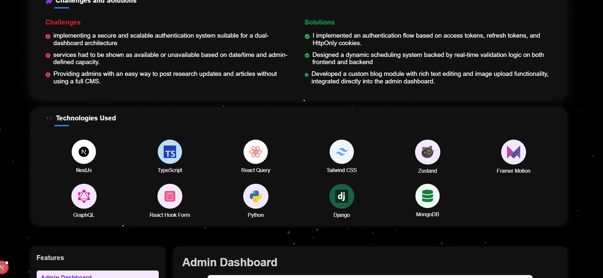

# Reza Portfolio

A modern and interactive **Front-End Developer Portfolio** built with cutting-edge technologies to showcase my skills, projects, and contact information.



## 🚀 Tech Stack & Why

- **Next.js**: For optimized routing, performance, and server-side rendering.
- **TailwindCSS**: For fast and responsive UI development with utility-first styling.
- **Framer Motion**: To bring smooth and elegant animations across the UI.
- **React Icons**: For adding vector icons in a consistent and lightweight way.
- **Swiper.js**: To create a fully responsive and smooth slider for project previews.

## ✨ Features

- 🔥 **Fully Responsive** – Looks great on all screen sizes (mobile, tablet, desktop).
- 🎨 **Smooth Animations** – Engaging user experience with Framer Motion.
- 💡 **About Section** – Introduction and overview of who I am.
- 🧰 **Skills Section** – Technologies and tools I’m proficient with.
- 🛠️ **Projects Section** – Includes:
  - Image preview
  - Project Overview
  - Key Features
  - Challenges & Solutions
  - Live link
  - GitHub link
- 🕶️ **Dark UI** – Stylish dark-themed interface with focus on readability.
- 📄 **Downloadable CV** – Allows users to download my resume easily.

## 🖼️ Project Screenshots

### 💼 My Experience



### 💼 My Projects


### 💼 My Skills



### 💼 Project Detail Page



## 🌐 Live Website

👉 [Visit RezaPortfolio.com](https://rezaportfolio.com)

---

## ⚙️ Getting Started (Installation & Running Locally)

To run this project on your local machine:

### 1. Clone the repository:

```bash
git clone https://github.com/RezaFarzipour/portfolio-website.git
```

### 2.Navigate to the project directory
```bash
cd my-portfolio
```

### 3.Install dependencies:
```bash
npm install
```

### 4.Run the development server
```bash
npm run dev
```

Now open http://localhost:3000 in your browser to see the project.

Designed & developed by Reza Farzipour 💻